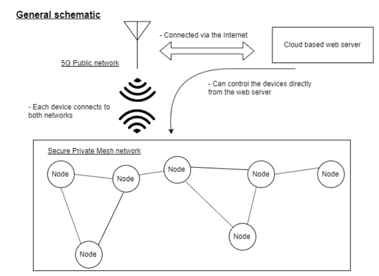

# Autoconfig-openthread
Program to automatically configure and manage a Thread network. It connects to the OpenThread devices (via serial port or HTTP)
and sends the orders to each device. Supports defining custom topologies for the network and is configurable using a YAML file (see config.yaml)

The sample configuration connects all the devices in a single network, opens UDP communication to a single node, and 
launches terminals to every board.

### Vision for the project
The goal is to have control over the full network via the 5G network, everything managed by a cloud server.

<p align="center">

</p>

### How to use
Configure the program using the config.yaml file. Code snippet:
```
# Configuration file for the autocommissioner program - PAE

# Device related configs
device: 
  device_type: 'Mock'         # Options are: 'USB', 'Mock' and 'HTTP' (although not implemented)
  mock_config:  
    number: 15                # Number of devices to create
  tty_config:
  http_config:
  commissioner_device_id: 7   # Id of the device to be the commissioner and to receive the udp messages
  udp_receiver_id: 0
# Topology related configs
topology:
  topology_type: 'all_to_one' # Currently only implemented 'all_to_one'
  plot: True                 # Requires the networkX package
# Terminal flag
open_terms: True
```

Run program:
```
python autocommission-new.py
```

### Requirements
The program requires:
-   Python +3.7 (uses f strings)
-   PyYaml package (for the configuration file)
-   PySerial package (for communicating with the boards via serial port)
-   NetworkX and Matplotlib (for plotting the network)

There's an included conda yaml file to install an environment with all the packages.

Conda instructions:

1- Install conda environment
```
conda env create -f environment.yml
```
2- Activate environment
```
conda activate iot-pae
```

### Problems and solutions 
**Errors when opening serial devices**\
Check that you have permission to access the serial ports, add your user to dialout group.

**Errors when plotting the topology**\
Check that you have specified a possible topology. Ie networkX should support any configuration but also may fail.

**General errors all over the program**\
Check that you are running python +3.7, sometimes people downgrade their python versions and problems arise, to fix this `conda install python=3.7`. Also check you have activated the environment.

**Gets stuck when activating the commissioner**\
Check that there's is a working terminal in the device. Run screen or miniterm on the board and check if you can send commands.


### TODOs
- ~~Initial script - Creates Thread network and opens UDP ports for two boards~~
- ~~Add capabilites to create network for N boards~~
- ~~Program rewrite using OOP~~
- ~~Add feature to design custom topologies for the network~~
- ~~Add function to graph the topology of the boards~~
- Add asyncronous features 
- Add logging module
- ~~Decouple configuration from the code via config file (YAML or similar)~~
- Create unit tests
- ~~Create thorough documentation~~
- Think about other use cases
- Create multiboard CLI (cmd module) 


